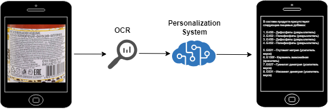

# ML System Design Doc - [RU]
## Дизайн ML системы - ClearNutritionExpert

### 1. Цели и предпосылки
#### 1.1. Зачем идем в разработку продукта?

## Дизайн ML системы - HealthyFoodMVP

### 1. Цели и предпосылки
#### 1.1. Зачем идем в разработку продукта?

- **Бизнес-цель:**
  - Разработка инновационного мобильного сервиса для определения вредных пищевых добавок в составе продуктов питания и предоставления персонализированных рекомендаций по их употреблению. Наша миссия заключается в помощи людям вести здоровый образ жизни, предотвращая потребление вредных веществ и улучшая их питание.

- **Чему помогаем:**
  - Наш продукт помогает снизить риски для здоровья, связанные с потреблением вредных добавок, предоставляя клиентам быстрый и надежный способ проверки состава продуктов. Это особенно важно для людей с особенностями здоровья, аллергиями, а также для религиозных групп и спортсменов.

- **Что считаем успехом:**
    - Приложение доступно на iOS и других платформах.
    - Приложение работает стабильно и не падает при большой нагрузке.
    - Приложение имеет понятную документацию по внедрению и использованию.

- **Расходы:**
  - **Работа дата-саентистов и разработчиков:** Включает оплату труда и прочие издержки, связанные с формированием и поддержанием команды, занимающейся созданием и поддержкой ML-моделей и мобильного приложения.
  - **Инфраструктурные затраты на ML-модели:** Включают расходы на вычислительные ресурсы (серверы или облачные вычисления), хранение данных, сетевую инфраструктуру и обеспечение безопасности.

#### 1.2. Бизнес-требования и ограничения  

- **Бизнес-требования:**
    - Код решения и данные должны быть частично открытыми, с учетом защиты чувствительных данных.
    - Используются только публично доступные или сгенерированные данные.
    - Приложение должно обрабатывать текстовые данные на нескольких языках.

- **Бизнес-ограничения:**
    - Приложение должно обрабатывать данные от 1 до 1000 токенов.
    - Приложение принимает 1 документ (фото состава продукта) за 1 запрос.
    - Приложение имеет простой и интуитивно понятный интерфейс.
    - На выходе приложение отдает рекомендации по продукту на основе профиля здоровья пользователя.
    - Время ответа не более 5 секунд.

- **Возможные пути развития проекта:**
  - Дообучение существующих моделей и тюнинг гиперпараметров.
  - Проверка новых моделей (OCR и NLP).
  - Расширение набора данных, обогащение более качественными примерами.
  - Масштабирование проекта на другие платформы (Android и т.д.).
  - Добавление мониторинга модели и данных.

- **Возможные применения проекта:**
  - Сканирование состава продуктов в магазинах.
  - Оценка безопасности продуктов для людей с особенностями здоровья.
  - Подбор продуктов для спортсменов и религиозных групп.

#### 1.3 Типичный сценарий использования

- Пользователь с аллергией на орехи сканирует состав продукта в магазине. Приложение моментально определяет наличие орехов в составе и выдает предупреждение о небезопасности продукта.

### 2. Методология

#### 2.1. Постановка задачи

Задача классификации и рекомендаций на основе текстовых данных.

#### 2.2 Критерии успеха технического решения

Ответ приложения не более 5 секунд и точность рекомендаций > 85%.

#### 2.3. Диаграмма архитектуры решения задачи

#### 2.4. Этапы решения задачи

**Этап 1. Подготовка данных**

- **Задачи:**
  - Собрать датасет текстов с составами продуктов (как фотографии так и тексты).
  - Сгенерировать необходимое количество примеров (хотя бы 1000).
  - Разметить данные (наличие аллергенов, вредных добавок и т.д.).

- **Риски и вызовы:**
  - Сделать качественную разметку.
  - Создать необходимый уровень разнообразия данных.

- **Выход:**
  - Не менее 1000 текстовых документов.
  - Не менее 50 фотографий с составами.
  - Баланс классов (наличие/отсутствие аллергенов) не хуже чем 4:1.
  - Оценка распределений, качества и характера данных.

**Этап 2. Построение Baseline ML модели**

- **Задачи:**
  - Реализовать обработку, чистку, представление текстовых данных.
  - Применить easyOCR для распознавания текста
  - Применить базовую NLP модель для рекомендаций.
  - Feature engineering.

- **Риски и вызовы:**
  - Сложности с распознаванием текстов на разных языках.

- **Выход:**
  - Стабильный пайплайн на Python.
  - Покрытие кода тестами не менее 50%.
  - Сохраненная модель.
  - Достигнуть указанного значения метрики.
  - Оценка вычислительной сложности и интерпретация моделей.

**Этап 3. Построение дополнительных моделей**

- **Задачи:**
  - Реализация и оценка других подходов помимо базовых.
  - Сохранение проведенных экспериментов.
  - Выбор оптимального решения, ансамблирование.

- **Риски и вызовы:**
  - Доступные мощности и время на эксперименты.

- **Выход:**
  - Документация по проведенным экспериментам.
  - Код по отвергнутым гипотезам в jupyter тетрадках.
  - Реализация оптимального варианта.

**Этап 4. Развертывание**

- **Задачи:**
  - Разработка API.
  - Развертывание системы на сервере.
  - Отладка мониторинга и логгирования.

- **Риски и вызовы:**
  - Проблемы с соблюдением ограничений из п. 1.2.

- **Выход:**
  - Доступный к использованию API.
  - Соответствующая документация.
  - Примеры использования в readme.

**Этап 5. Разработка мобильного приложения**

- **Задачи:**
  - Создание приложения для iOS.
  - Возможность сканирования текста продукта.
  - Возможность получения рекомендаций по продукту.
  - Обработка ошибок и нестандартных юз-кейсов.

- **Риски и вызовы:**
  - Сложности с интеграцией моделей в мобильное приложение.

- **Выход:**
  - Соответствующая кодовая база.
  - Работающее мобильное приложение с заявленным функционалом.

**Этап 6. Тестирование и отладка**

- **Задачи:**
  - Устранение технического долга.
  - Тестирование системы.
  - Привлечение пользователей для пробного использования системы.
  - Отработка сценариев отказа и повреждения системы.

- **Риски и вызовы:**
  - Ненадежность системы, сбои в работе.
  - Уязвимости системы.

- **Выход:**
  - Необходимые исправления и доработки.

**Этап 7. Создание финального отчета**

- **Задачи:**
  - Подготовить защиту проекта.

- **Риски и вызовы:**
  - Линейная работа с предсказуемым результатом.

- **Выход:**
  - План презентации.
  - Необходимые материалы к демо.
  - Небольшой Google Colab для демо.

#### 2.5. Данные для задачи

Мы собрали больше 5000 примеров текстов с составами продуктов, включая данные о наличии аллергенов и вредных добавок (по матчу составов регулярными выражениями).

Также мы собрали 55 фотографий составов продуктов.

#### 3. Внедрение
#### 3.1. Архитектура решения

#### 3.2. Описание инфраструктуры и масштабируемости

- Основная серверная часть реализована с помощью фреймворка FastAPI.
- Мобильное приложение написано на Swift для iOS.
- Модель easyOCR для распознавания текста и NLP модель для рекомендаций.
- Общение сервера с моделью происходит посредством API.

#### 3.3. Технические требования

**Минимальный состав аппаратных средств**

- Персональный компьютер с операционной системой Ubuntu 20:04 и выше.
- Процессор с частотой не менее 3 ГГц.
- GPU видеокарту серии NVIDIA GTX 1080Ti и выше.
- Наличие устройств ввода.
- Оперативная память не менее 8Гб.
- Жесткий диск объемом 40 Гб и выше.

**Минимальный состав программных средств**

- Python версии 3.8 или выше и установленные зависимости.
- Набор инструментов CUDA для Linux версии 11.3 или

#### 3.4. Требования к работе системы
Пропускная способность и задержка обеспечивается структурой и возможностью масштабирования

#### 3.5. Безопасность системы
Обеспечивается отсутствием внешних связей
